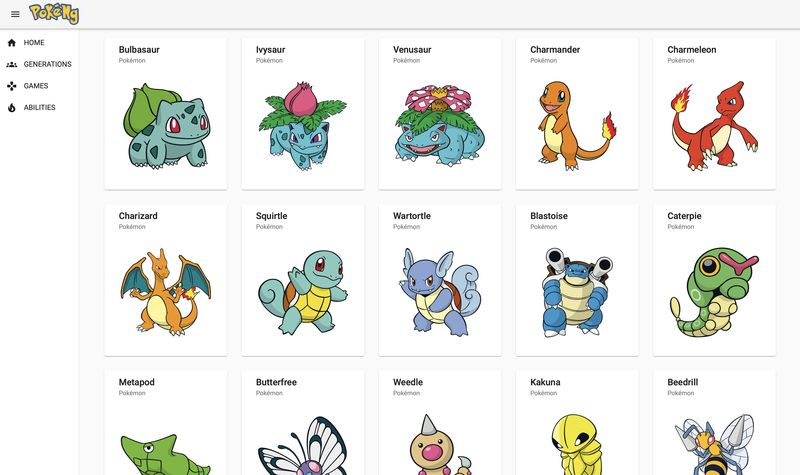

---

# Purpose

Building an (a simple) Angular SPA for Browsing Pokémon. Consumes the [PokéAPI](https://www.pokeapi.co) RESTful API. And no, it's not a Pokédex, i might create one someday.

# Screenshots / Progress

*(September 2020) Initial design / layout for the app, showing the first 151 Pokémon*

Features:
- Docker Compose setup (September 2020)
- SSR (September 2020)
- Initial PWA functionality (02.01.2021)
- A list of Pokémon from each generation can be selected (19.01.2021)
- Automatic deployment via GitHub Actions (19.01.2021)
- List of games up to fith generation (22.01.2021)

# Demo

This app is currently hosted on Google Firebase. Server Side Rendering is realized via Firebase Functions. [Have a look](https://pokemon-app-51156.web.app).

# WIPs

This list is in no particular order respectively prioritized.

- This readme needs some work 😅
- The Docker Compose build action is still a work in progress. The badge only shows that the build was successful. No information regarding tests.
- A list of all games with their artwork
- Tests for CD / CI
- Additional info for each Pokémon (abilities, appearances, stats etc.) 

# Journal

- **(19.01.2021)**: Today i tried to learn `GitHub Actions` in order to automatically deploy the app on Firebase. I pushed directly into master to test wether my configuration would work, that's something that should be avoided at all cost. For me this was quite a challenge but after several hours i came up with a solution. I also added a badge for a succesful deployment 😁. 

- **(22.01.2021)**: Merged some new features (games list, sidebar nav default opened in desktop mode, bugfixes) into master. Automatic is working as intended. I'll have to start thinking about how to further design the app and what features it should have. 
